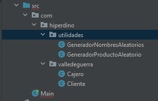

# UD5 - Practica 1
- Autor:
  - Nombre:
    - Ana Isabel González Rosales
  - Fecha:
    - Mayo 2023
  - Email:
    - anaigrosales@gmail.com
  - git:
    - https://github.com/AnaIsabelValle/UD5-Practica1
    
## Introducción:

Nos solicita el grupo Hiperdino que desarrollemos una simulación de uno de sus supermercados.

## Análisis:
Se basa en una estructura de datos donde interactuan:
- Cliente: que dispone de un nombre y una cesta de la compra
- Cajero: que dispone de un número que lo identifica y una cola de clientes que irá atendiendo de uno a uno
- Cesta de la compra: que apilan sus productos uno encima de otro

## Sintaxis:
1. Creación de paquetes:
   1. Paquete raíz llamado com, incluye:
      1. Paquete hiperdino, que se componen de :
         1. Paquete valledeguerra.
         2. Paquete utilidades.
2. Creación de clases:
   1. Dentro del paquete hiperdino, se encuentra la clase ejecutable:
      1. Main
   2. Dentro del paquete valleguerra, se han creado las clases:
         1. Cajero
         2. Cliente
   3. Dentro del paquete utilidades, se han creado las clases:
      1. Generador de Productos Aleatorios
      2. Generador de Nombres Aleatorios
- Quedando los paquetes y clases de la siguiente manera:

3. Métodos:
   1. En la clase ejecutable Main:
      1. Elaboración del Menú 
   2. En la clase Generador de Productos:
      1. Se implementa un método estático que devuelva un producto aletario
   3. En la clase Generador de Nombres Aleatorios:
      1. Se implementa un método estátido que deveulve un nombre aleatorio.
   4. En la clase Cliente:
      1. Se implementan:
         1. Atributos
         2. Constructor
         3. Getters:
            1. getNombre
            2. getTotalProductos
         4. Métodos:
            1. Añadir a la cesta
            2. Quitar de la cesta
         5. Método de sobreescribir:
            1. toString
   5. En la clase Cajero:
      1. Se implementan:
         1. Atributos
         2. Constructor
         3. Getters:
            1. getNumeroCajero
         4. Métodos:
            1. Añadir cliente
            2. Atender cliente
            3. Listado de clientes
         5. Método de sobreescribir:
            1. toString

